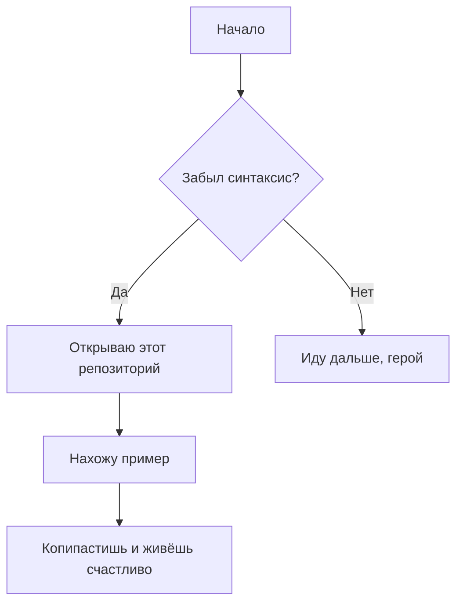

# 📚 Шпаргалки по Markdown & Mermaid  
### Или: «Как не забыть, как это всё работает»  
*Подготовлено с помощью силы мысли, пары кофе и помощи Qwen* ☕🤖

---

## 🎯 О чём этот репозиторий?

Привет, странник интернета! 👋  
Это мой личный *сейф с памятками*, где я храню шпаргалки по **Markdown** и **Mermaid** — потому что:

> ❝Я не ленивый, я просто оптимизирую использование памяти.❞

Каждый раз, когда я забываю, как сделать таблицу или диаграмму, я прихожу сюда, как к старому другу, и говорю:  
**"Эй, напомни-ка мне!"** 💬

---

## 🧩 Что внутри?

### ✅ Markdown — язык разметки для тех, кто любит писать, но не хочет лезть в HTML
- Заголовки, списки, ссылки, цитаты, код — всё, что нужно, чтобы выглядеть умно в `.md`-файлах.
- Примеры с пояснениями, чтобы ты не гуглил каждый раз, как вставить `код`.

### 🌈 Mermaid — магия диаграмм прямо в тексте
- Диаграммы классов, последовательности, графы, Gantt-диаграммы — всё это без рисования в Figma.
- Просто пишешь код → получаешь картинку (всё, как в кино, только без блокбастера).

---

## 🧠 Примеры? Конечно!

### Пример Markdown:
```markdown
# Заголовок
- [x] Сделать шпаргалку
- [ ] Завоевать мир

> Цитата мудрого человека (скорее всего, меня)
```

### Пример Mermaid:


---

## 🤖 Спасибо, Qwen!

Этот README не родился бы без помощи **Qwen** — моего цифрового соавтора, наставника и спасителя от гугления.  
Ты — как Stack Overflow, но с чувством юмора. 🙏

[readme тоже Qwen писал](https://chat.qwen.ai/s/dc2a91b3-13f5-4276-8fbb-235516618aa4?fev=0.0.184)
---

## 📢 Лицензия?

Свободно копируй, воруй, улучшай — я не против.  
Главное — не забудь поставить звёздочку ⭐ и не приписывай себе мой гений (я шучу, ты и так гений).

---

## 🌟 Поддержи проект

1. Поставь ⭐ — это бесплатно и делает меня счастливее.
2. Напиши issue с предложением — "А давай добавим ещё шпаргалку по LaTeX?"
3. Поделись с другом, который всё ещё рисует диаграммы в Paint.

---

> *P.S. Если ты дочитал до сюда — ты герой.  
> А героям полагается чашка чая. Или кофе. Или пивка. Я не сужу.* 🍵🍻
