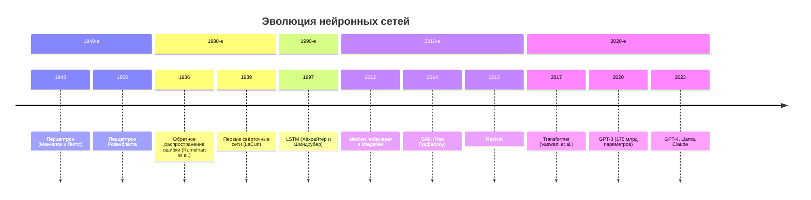
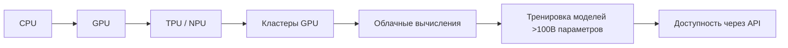
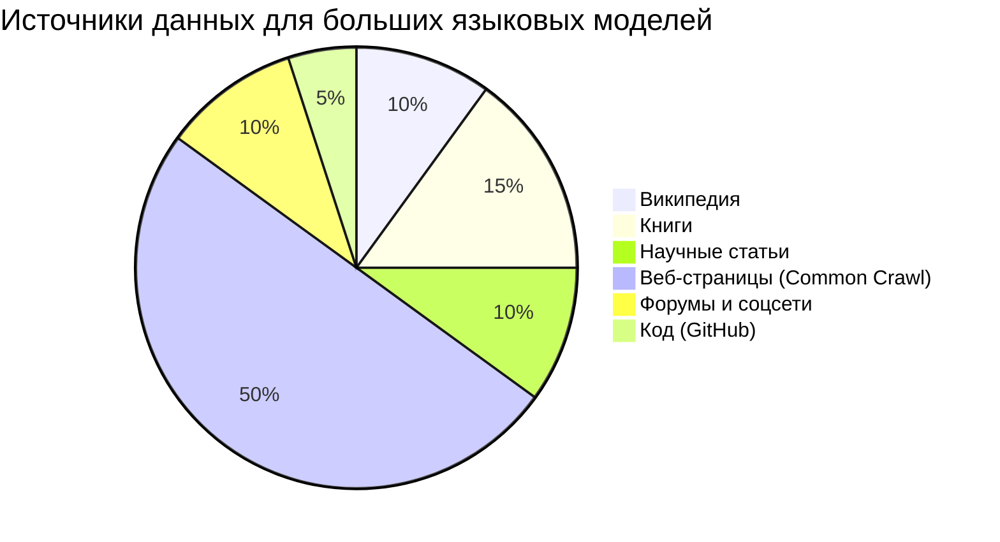
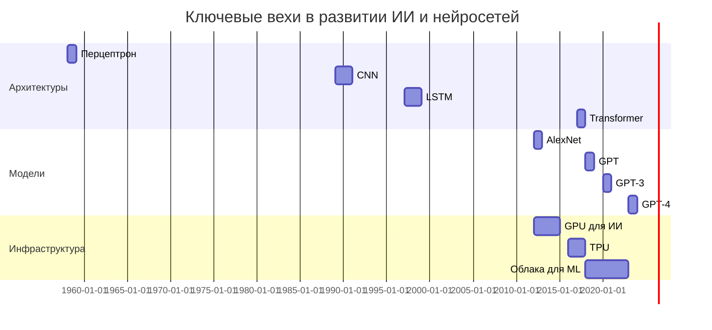
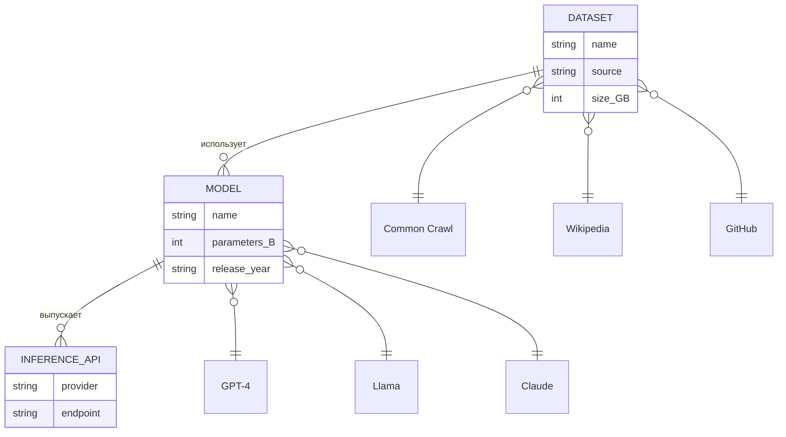
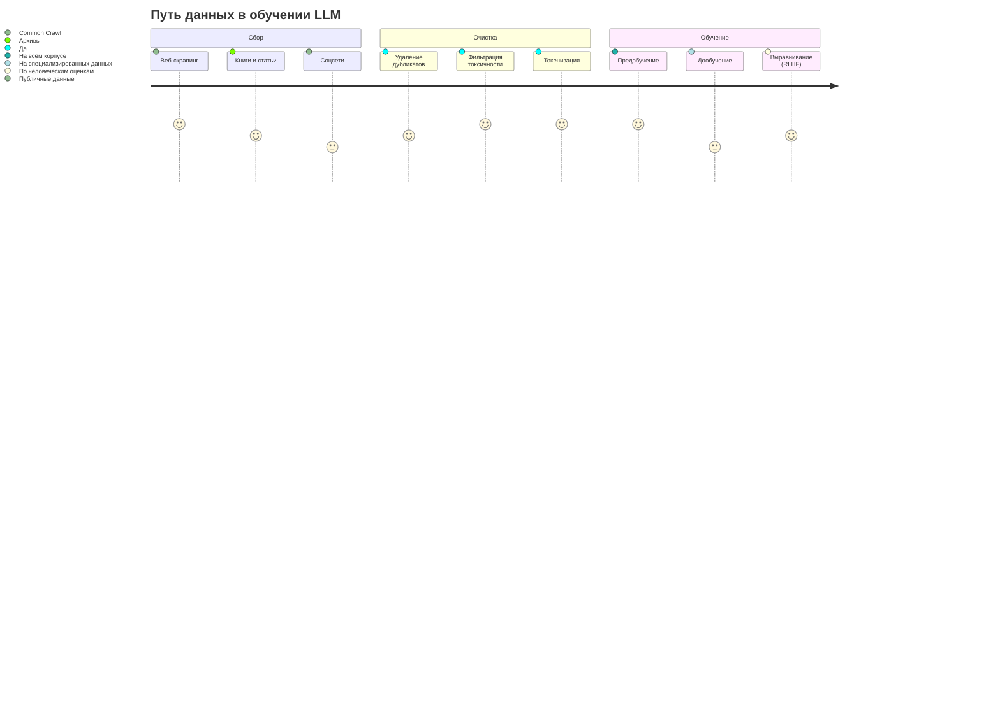
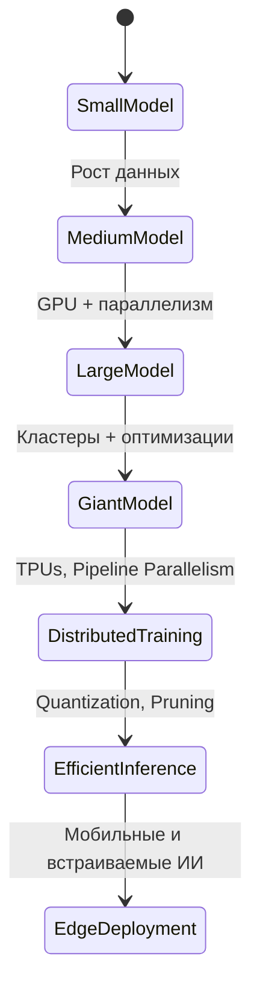

---

## 🧠 Шпаргалка по Mermaid: История нейронных сетей

> Вставьте любой блок кода ниже в `README.md`, обернув его в тройные апострофы с указанием `mermaid`:
> ````
> ```mermaid
> ваш_код_здесь
> ```
> ````

---

### 1. **Timeline (Жизненная лента) — Эволюция нейросетей**


---

### 2. **Flowchart (Блок-схема) — Архитектуры нейросетей**
```mermaid
flowchart TD
    A[Ранние сети] --> B[Перцептрон]
    A --> C[Многослойный перцептрон]
    C --> D[Свёрточные сети (CNN)]
    C --> E[Рекуррентные сети (RNN)]
    E --> F[LSTM / GRU]
    C --> G[Transformer]
    G --> H[Большие языковые модели]
    H --> I[GPT, Llama, PaLM]
    H --> J[Мультимодальные модели]
```

---

### 3. **Graph (Граф зависимостей) — Развитие вычислительных мощностей**


---

### 4. **Pie Chart — Источники данных для LLM**


---

### 5. **Gantt (Диаграмма Ганта) — Ключевые события в ИИ**


---

### 6. **ER Diagram — Источники данных и модели**


---

### 7. **User Journey — Путь данных в LLM**


---

### 8. **State Diagram — Эволюция масштаба моделей**


---

## ✅ Как использовать
1. Скопируйте нужный блок.
2. Вставьте в `README.md` между тройными апострофами:
   ````markdown
   ```mermaid
   ваш_диаграмма_здесь
   ```
   ````
3. Убедитесь, что ваш хостинг (GitHub, GitLab и др.) поддерживает Mermaid.
   > ⚠️ GitHub пока **не поддерживает Mermaid по умолчанию** в README, но вы можете:
   > - Использовать [Mermaid Live Editor](https://mermaid.live) для генерации изображений.
   > - Или использовать платформы, где Mermaid работает (например, GitLab, Obsidian, Docusaurus).

---

## 📌 Советы
- Для GitHub: сохраните диаграммы как изображения через [mermaid.live](https://mermaid.live).
- Используйте `%% комментарии` внутри Mermaid, чтобы пояснить логику.
- Тестируйте диаграммы в редакторе: [Mermaid Live Editor](https://mermaid.live/edit)

