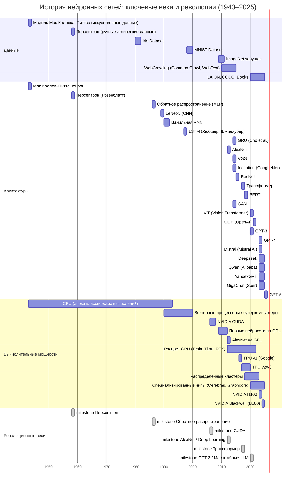

```mermaid 


gantt
    title История нейронных сетей: ключевые вехи и революции (1943–2025)
    dateFormat  YYYY
    axisFormat %Y
    section Данные
    Модель Мак-Каллока–Питтса (искусственные данные) : 1943, 1y
    Персептрон (ручные логические данные) : 1958, 1y
    Iris Dataset : 1980, 2y
    MNIST Dataset : 1998, 2y
    ImageNet запущен : 2009, 2y
    WebCrawling (Common Crawl, WebText) : 2010, 5y
    LAION, COCO, Books : 2020, 5y

    section Архитектуры
    Мак-Каллок–Питтс нейрон : 1943, 1y
    Персептрон (Розенблатт) : 1958, 1y
    Обратное распространение (MLP) : 1986, 1y
    LeNet-5 (CNN) : 1989, 1y
    Ванильная RNN : 1990, 2y
    LSTM (Хюбшер, Шмидхубер) : 1997, 1y
    GRU (Cho et al.) : 2014, 1y
    AlexNet : 2012, 1y
    VGG : 2014, 1y
    Inception (GoogLeNet) : 2014, 1y
    ResNet : 2015, 1y
    Трансформер : 2017, 1y
    BERT : 2018, 1y
    GAN : 2014, 1y
    ViT (Vision Transformer) : 2020, 1y
    CLIP (OpenAI) : 2021, 1y
    GPT-3 : 2020, 1y
    GPT-4 : 2023, 1y
    Mistral (Mistral AI) : 2023, 1y
    Deepseek : 2023, 2y
    Qwen (Alibaba) : 2023, 2y
    YandexGPT : 2023, 2y
    GigaChat (Sber) : 2023, 2y
    GPT-5 : 2025, 1y

    section Вычислительные мощности
    CPU (эпоха классических вычислений) : 1943, 50y
    Векторные процессоры / суперкомпьютеры : 1990, 10y
    NVIDIA CUDA : 2006, 2y
    Первые нейросети на GPU : 2009, 3y
    AlexNet на GPU : 2012, 1y
    Расцвет GPU (Tesla, Titan, RTX) : 2012, 10y
    TPU v1 (Google) : 2016, 1y
    TPU v2/v3 : 2017, 3y
    Распределённые кластеры : 2018, 5y
    Специализированные чипы (Cerebras, Graphcore) : 2020, 5y
    NVIDIA H100 : 2023, 1y
    NVIDIA Blackwell (B100) : 2024, 1y

    section Революционные вехи
    milestone Персептрон : done, 1958, 1y
    milestone Обратное распространение : done, 1986, 1y
    milestone CUDA : done, 2006, 1y
    milestone AlexNet / Deep Learning : done, 2012, 1y
    milestone Трансформер : done, 2017, 1y
    milestone GPT-3 / Масштабные LLM : done, 2020, 1y

```