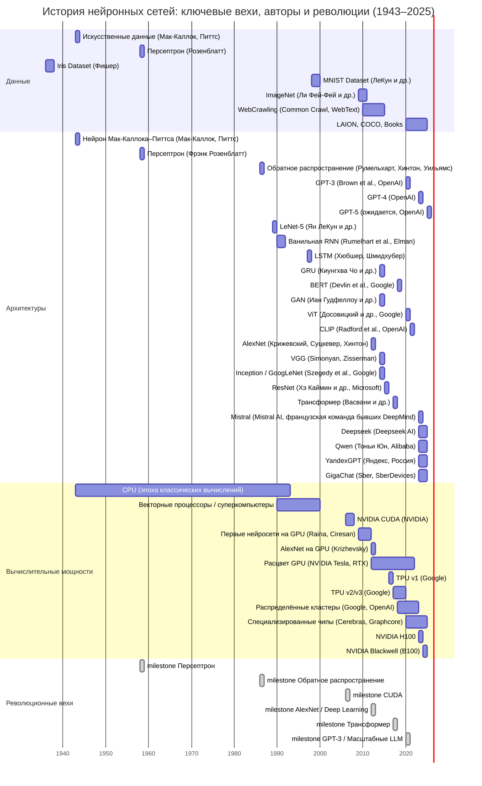

```mermaid 


gantt
    title История нейронных сетей: ключевые вехи, авторы и революции (1943–2025)
    dateFormat  YYYY
    axisFormat %Y
    section Данные
    Искусственные данные (Мак-Каллок, Питтс) : 1943, 1y
    Персептрон (Розенблатт) : 1958, 1y
    Iris Dataset (Фишер) : 1936, 2y
    MNIST Dataset (ЛеКун и др.) : 1998, 2y
    ImageNet (Ли Фей-Фей и др.) : 2009, 2y
    WebCrawling (Common Crawl, WebText) : 2010, 5y
    LAION, COCO, Books : 2020, 5y

    section Архитектуры
    Нейрон Мак-Каллока–Питтса (Мак-Каллок, Питтс) : 1943, 1y
    Персептрон (Фрэнк Розенблатт) : 1958, 1y
    Обратное распространение (Румельхарт, Хинтон, Уильямс) : 1986, 1y
    GPT-3 (Brown et al., OpenAI) : 2020, 1y
    GPT-4 (OpenAI) : 2023, 1y
    GPT-5 (ожидается, OpenAI) : 2025, 1y
    LeNet-5 (Ян ЛеКун и др.) : 1989, 1y
    Ванильная RNN (Rumelhart et al., Elman) : 1990, 2y
    LSTM (Хюбшер, Шмидхубер) : 1997, 1y
    GRU (Киунгхва Чо и др.) : 2014, 1y

    BERT (Devlin et al., Google) : 2018, 1y
    GAN (Иан Гудфеллоу и др.) : 2014, 1y
    ViT (Досовицкий и др., Google) : 2020, 1y
    CLIP (Radford et al., OpenAI) : 2021, 1y
    AlexNet (Крижевский, Суцкевер, Хинтон) : 2012, 1y
    VGG (Simonyan, Zisserman) : 2014, 1y
    Inception / GoogLeNet (Szegedy et al., Google) : 2014, 1y
    ResNet (Хэ Каймин и др., Microsoft) : 2015, 1y
    Трансформер (Васвани и др.) : 2017, 1y


    Mistral (Mistral AI, французская команда бывших DeepMind) : 2023, 1y
    Deepseek (Deepseek AI) : 2023, 2y
    Qwen (Тоньи Юн, Alibaba) : 2023, 2y
    YandexGPT (Яндекс, Россия) : 2023, 2y
    GigaChat (Sber, SberDevices) : 2023, 2y


    section Вычислительные мощности
    CPU (эпоха классических вычислений) : 1943, 50y
    Векторные процессоры / суперкомпьютеры : 1990, 10y
    NVIDIA CUDA (NVIDIA) : 2006, 2y
    Первые нейросети на GPU (Raina, Ciresan) : 2009, 3y
    AlexNet на GPU (Krizhevsky) : 2012, 1y
    Расцвет GPU (NVIDIA Tesla, RTX) : 2012, 10y
    TPU v1 (Google) : 2016, 1y
    TPU v2/v3 (Google) : 2017, 3y
    Распределённые кластеры (Google, OpenAI) : 2018, 5y
    Специализированные чипы (Cerebras, Graphcore) : 2020, 5y
    NVIDIA H100 : 2023, 1y
    NVIDIA Blackwell (B100) : 2024, 1y

    section Революционные вехи
    milestone Персептрон : done, 1958, 1y
    milestone Обратное распространение : done, 1986, 1y
    milestone CUDA : done, 2006, 1y
    milestone AlexNet / Deep Learning : done, 2012, 1y
    milestone Трансформер : done, 2017, 1y
    milestone GPT-3 / Масштабные LLM : done, 2020, 1y

```