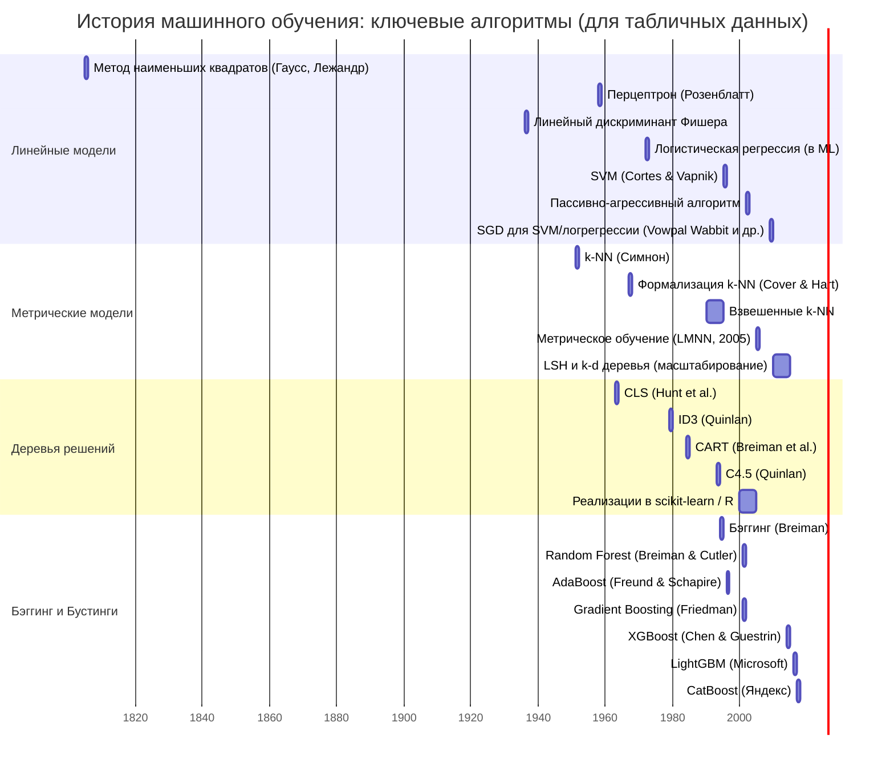
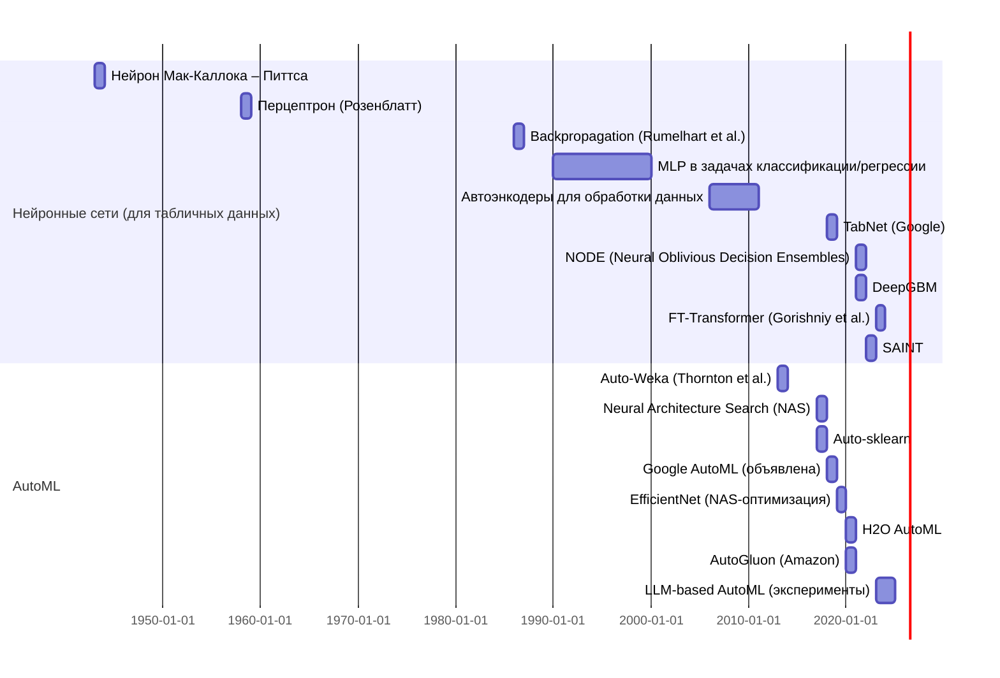

```mermaid

gantt
    title История машинного обучения: ключевые алгоритмы (для табличных данных)
    dateFormat  YYYY
    axisFormat  %Y
    section Линейные модели
    Метод наименьших квадратов (Гаусс, Лежандр)        : 1805, 1y
    Перцептрон (Розенблатт)                           : 1958, 1y
    Линейный дискриминант Фишера                      : 1936, 1y
    Логистическая регрессия (в ML)                    : 1972, 1y
    SVM (Cortes & Vapnik)                             : 1995, 1y
    Пассивно-агрессивный алгоритм                     : 2002, 1y
    SGD для SVM/логрегрессии (Vowpal Wabbit и др.)    : 2009, 1y

    section Метрические модели
    k-NN (Симнон)                                     : 1951, 1y
    Формализация k-NN (Cover & Hart)                  : 1967, 1y
    Взвешенные k-NN                                   : 1990, 5y
    Метрическое обучение (LMNN, 2005)                 : 2005, 1y
    LSH и k-d деревья (масштабирование)               : 2010, 5y

    section Деревья решений
    CLS (Hunt et al.)                                 : 1963, 1y
    ID3 (Quinlan)                                     : 1979, 1y
    CART (Breiman et al.)                             : 1984, 1y
    C4.5 (Quinlan)                                    : 1993, 1y
    Реализации в scikit-learn / R                     : 2000, 5y

    section Бэггинг и Бустинги
    Бэггинг (Breiman)                                 : 1994, 1y
    Random Forest (Breiman & Cutler)                  : 2001, 1y
    AdaBoost (Freund & Schapire)                      : 1996, 1y
    Gradient Boosting (Friedman)                      : 2001, 1y
    XGBoost (Chen & Guestrin)                         : 2014, 1y
    LightGBM (Microsoft)                              : 2016, 1y
    CatBoost (Яндекс)                                 : 2017, 1y
```

```mermaid

gantt
    section Нейронные сети (для табличных данных)
    Нейрон Мак-Каллока – Питтса                       : 1943, 1y
    Перцептрон (Розенблатт)                          : 1958, 1y
    Backpropagation (Rumelhart et al.)                : 1986, 1y
    MLP в задачах классификации/регрессии             : 1990, 10y
    Автоэнкодеры для обработки данных                 : 2006, 5y
    TabNet (Google)                                   : 2018, 1y
    NODE (Neural Oblivious Decision Ensembles)        : 2021, 1y
    DeepGBM                                           : 2021, 1y
    FT-Transformer (Gorishniy et al.)                 : 2023, 1y
    SAINT                                             : 2022, 1y

    section AutoML
    Auto-Weka (Thornton et al.)                       : 2013, 1y
    Neural Architecture Search (NAS)                  : 2017, 1y
    Auto-sklearn                                      : 2017, 1y
    Google AutoML (объявлена)                         : 2018, 1y
    EfficientNet (NAS-оптимизация)                    : 2019, 1y
    H2O AutoML                                        : 2020, 1y
    AutoGluon (Amazon)                                : 2020, 1y
    LLM-based AutoML (эксперименты)                   : 2023, 2y

```