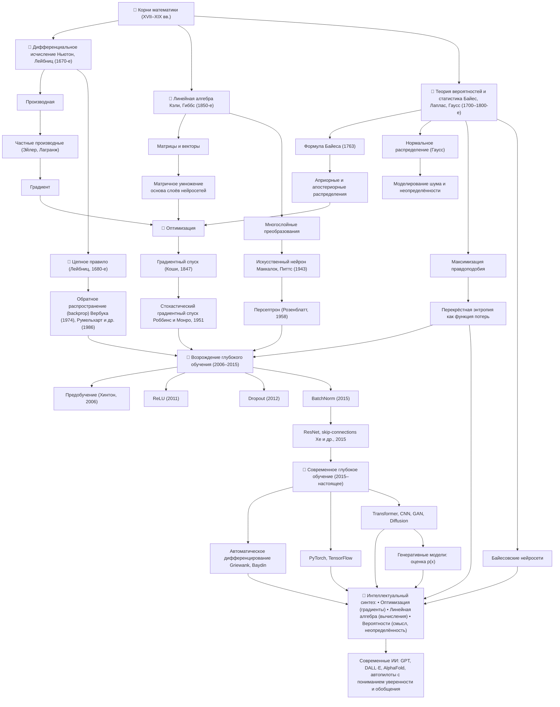

```mermaid
graph TD
    A["🌱 Корни математики (XVII–XIX вв.)"]
    A --> B["🔹 Дифференциальное исчисление Ньютон, Лейбниц (1670-е)"]
    A --> C["🔹 Линейная алгебра Кэли, Гиббс (1850-е)"]
    A --> D["🔹 Теория вероятностей и статистика Байес, Лаплас, Гаусс (1700–1800-е)"]

    B --> B1["Производная"]
    B1 --> B2["Частные производные (Эйлер, Лагранж)"]
    B2 --> B3["Градиент"]

    C --> C1["Матрицы и векторы"]
    C1 --> C2["Матричное умножение\nоснова слоёв нейросетей"]

    D --> D1["Формула Байеса (1763)"]
    D --> D2["Нормальное распределение (Гаусс)"]
    D1 --> D3["Априорные и апостериорные распределения"]
    D2 --> D4["Моделирование шума и неопределённости"]

    B3 --> E["🔹 Оптимизация"]
    C2 --> E
    D3 --> E

    E --> E1["Градиентный спуск (Коши, 1847)"]
    E1 --> E2["Стохастический градиентный спуск Роббинс и Монро, 1951"]

    B --> F["🔹 Цепное правило (Лейбниц, 1680-е)"]
    F --> G["Обратное распространение (backprop) Вербука (1974), Румельхарт и др. (1986)"]

    D --> H["Максимизация правдоподобия"]
    H --> I["Перекрёстная энтропия как функция потерь"]

    C --> J["Многослойные преобразования"]
    J --> K["Искусственный нейрон Маккалок, Питтс (1943)"]
    K --> L["Персептрон (Розенблатт, 1958)"]

    L --> M["🔹 Возрождение глубокого обучения (2006–2015)"]
    G --> M
    E2 --> M
    I --> M

    M --> M1["Предобучение (Хинтон, 2006)"]
    M --> M2["ReLU (2011)"]
    M --> M3["Dropout (2012)"]
    M --> M4["BatchNorm (2015)"]
    M4 --> M5["ResNet, skip-connections Хе и др., 2015"]

    M5 --> N["🔹 Современное глубокое обучение (2015–настоящее)"]
    N --> N1["Автоматическое дифференцирование Griewank, Baydin"]
    N --> N2["PyTorch, TensorFlow"]
    N --> N3["Transformer, CNN, GAN, Diffusion"]

    N1 --> O["Интеллектуальный синтез"]
    N2 --> O
    N3 --> O

    D --> P["Байесовские нейросети"]
    P --> O
    I --> O
    N3 --> Q["Генеративные модели: оценка p(x)"]
    Q --> O

    O["🔹 Интеллектуальный синтез: • Оптимизация (градиенты) • Линейная алгебра (вычисления) • Вероятности (смысл, неопределённость)"]
    O --> R["Современные ИИ: GPT, DALL·E, AlphaFold, автопилоты с пониманием уверенности и обобщения"]
```