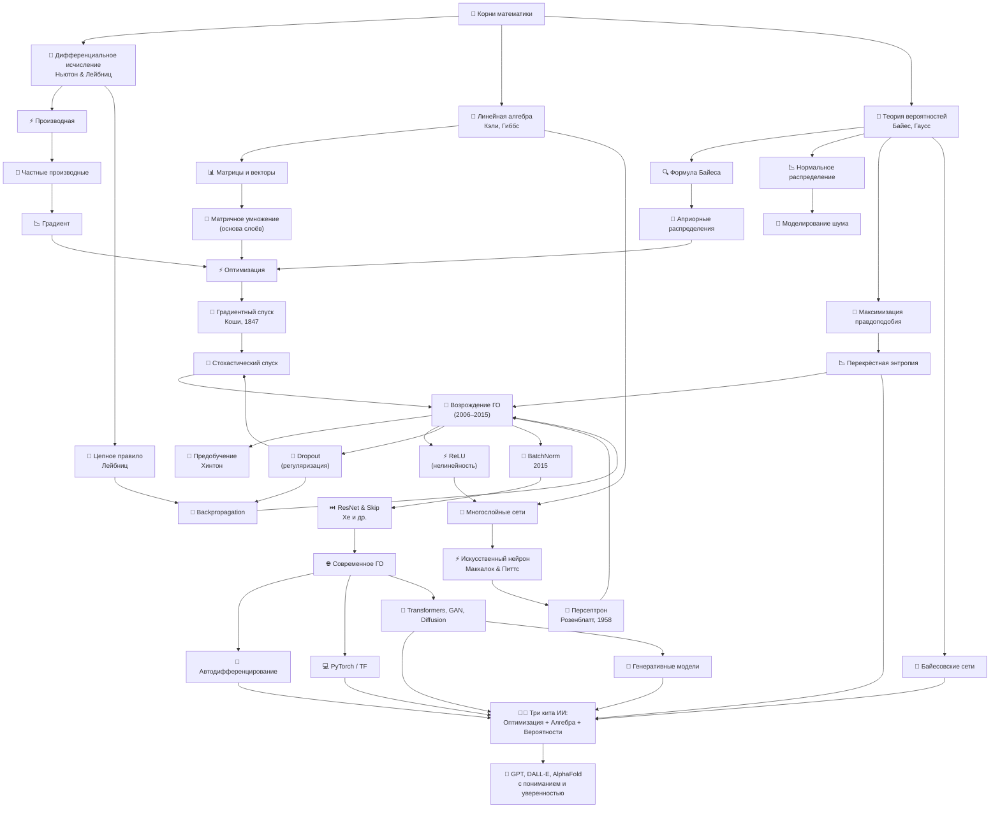

```mermaid
graph TD
    A["🌱 Корни математики"] 
    A --> B["🧮 Дифференциальное исчисление<br>Ньютон & Лейбниц"]
    A --> C["🔁 Линейная алгебра<br>Кэли, Гиббс"]
    A --> D["🎲 Теория вероятностей<br>Байес, Гаусс"]

    B --> B1["⚡ Производная"]
    B1 --> B2["📍 Частные производные"]
    B2 --> B3["📉 Градиент"]

    C --> C1["📊 Матрицы и векторы"]
    C1 --> C2["🧠 Матричное умножение<br>(основа слоёв)"]

    D --> D1["🔍 Формула Байеса"]
    D --> D2["📉 Нормальное распределение"]
    D1 --> D3["📌 Априорные распределения"]
    D2 --> D4["🤖 Моделирование шума"]

    B3 --> E["⚡ Оптимизация"]
    C2 --> E
    D3 --> E

    E --> E1["🧭 Градиентный спуск<br>Коши, 1847"]
    E1 --> E2["🎲 Стохастический спуск<br>Роббинс & Монро"]

    B --> F["🔗 Цепное правило<br>Лейбниц"]
    F --> G["🔄 Backpropagation<br>Вербука, Румельхарт"]

    D --> H["🎯 Максимизация правдоподобия"]
    H --> I["📉 Перекрёстная энтропия"]

    C --> J["🧠 Многослойные сети"]
    J --> K["⚡ Искусственный нейрон<br>Маккалок & Питтс"]
    K --> L["🧠 Персептрон<br>Розенблатт, 1958"]

    L --> M["🚀 Возрождение ГО<br>(2006–2015)"]
    G --> M
    E2 --> M
    I --> M

    M --> M1["🔋 Предобучение<br>Хинтон"]
    M --> M2["⚡ ReLU<br>(нелинейность)"]
    M --> M3["🎲 Dropout<br>(регуляризация)"]
    M --> M4["📏 BatchNorm<br>2015"]
    M4 --> M5["⏭️ ResNet & Skip<br>Хе и др."]

    M2 --> J["🧠 Многослойные сети"]  
    M3 --> E2["🎲 Стохастический спуск"]  
    M3 --> G["🔄 Backpropagation"]        
    M5 --> N["🌐 Современное ГО"]
    N --> N1["🤖 Автодифференцирование"]
    N --> N2["💻 PyTorch / TF"]
    N --> N3["🧠 Transformers, GAN, Diffusion"]

    N1 --> O["✨ Интеллектуальный синтез"]
    N2 --> O
    N3 --> O
    D --> P["🧠 Байесовские сети"]
    P --> O
    I --> O
    N3 --> Q["🎨 Генеративные модели"]
    Q --> O

    O["🧠💡 Три кита ИИ:<br>Оптимизация + Алгебра + Вероятности"]
    O --> R["🚀 GPT, DALL·E, AlphaFold<br>с пониманием и уверенностью"]
```