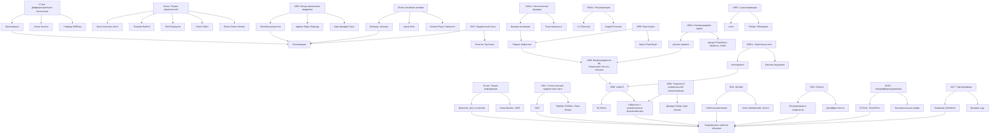

```mermaid

graph TD
    A[17 век: Дифференциальное исчисление] --> B[Производные]
    A --> C[Исаак Ньютон]
    A --> D[Готфрид Лейбниц]

    E[18 век: Теория вероятностей] --> F[Закон больших чисел]
    E --> G[Теорема Байеса]
    E --> H[Якоб Бернулли]
    E --> I[Томас Байес]
    E --> J[Пierre-Симон Лаплас]

    K[1805: Метод наименьших квадратов] --> L[Линейная регрессия]
    K --> M[Адриен Мари Лежандр]
    K --> N[Карл Фридрих Гаусс]

    O[19 век: Линейная алгебра] --> P[Матрицы, векторы]
    O --> Q[Артур Кэли]
    O --> R[Уильям Роуэн Гамильтон]

    S[1847: Градиентный спуск] --> T[Оптимизация]
    S --> U[Огюстен Луи Коши]

    V[1840-е: Логистическая функция] --> W[Функции активации]
    V --> X[Пьер Ферхюльст]

    Y[20 век: Теория информации] --> Z[Энтропия, кросс-энтропия]
    Y --> AA[Клод Шеннон, 1948]

    AB[1940-е: Регуляризация] --> AC["L2 (Тихонов)"]
    AB --> AD[Андрей Тихонов]

    AE[1951: Стохастический градиентный спуск] --> AF[SGD]
    AE --> AG[Герберт Роббинс, Свен Монро]

    AH[1958: Персептрон] --> AI[Первые нейросети]
    AH --> AJ[Фрэнк Розенблатт]

    AK["1960-е: Backpropagation (идея)"] --> AL[Цепное правило]
    AK --> AM[Артуро Розенблатт, Брайсон, Уэлби]
    AL --> AN[1986: Backpropagation в ML<br>Румельхарт, Хинтон, Уильямс]

    AO[1980-е: Свёрточные сети] --> AP[Neocognitron]
    AO --> AQ[Канничи Фукушима]
    AP --> AR[1998: LeNet-5]
    AR --> AS[Ян ЛеКун]

    AT[1989: Теорема об универсальной аппроксимации] --> AU[Нейросети = универсальные аппроксиматоры]
    AT --> AV[Джордж Сиборг, Курт Хорник]

    AW[1996: L1-регуляризация] --> AX[Lasso]
    AW --> AY[Роберт Тибширани]

    AZ[2012: AlexNet] --> BA[Глубокая революция]
    AZ --> BB[Алекс Крижевский, Хинтон]
    BA --> BC[Современное глубокое обучение]

    BD[2012: Dropout] --> BE[Регуляризация в нейросетях]
    BD --> BF[Джеффри Хинтон]

    BG[2015+: Автодифференцирование] --> BH[PyTorch, TensorFlow]
    BG --> BI[Вычислительные графы]

    BJ[2017: Трансформеры] --> BK["Внимание (Attention)"]
    BJ --> BL[Васвани и др.]

    B --> T
    L --> T
    P --> T
    W --> AI
    AI --> AN
    AN --> AR
    AR --> AU
    AU --> BC
    Z --> BC
    AF --> BC
    BE --> BC
    BH --> BC
    BK --> BC

```