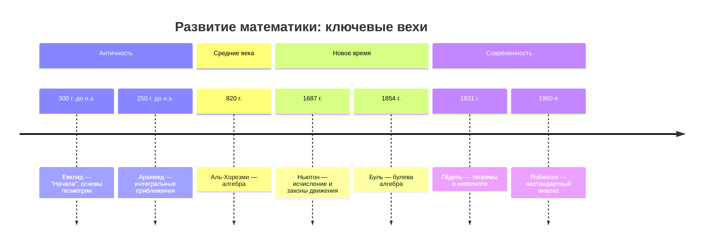

```markdown
# Исследование истории математики и искусственного интеллекта с помощью Mermaid

Этот проект посвящён визуализации ключевых вех в развитии **математики** и **искусственного интеллекта (ИИ)** с использованием языка разметки [Mermaid](https://mermaid.js.org/). 

Диаграммы строятся на основе диалогов с моделью Qwen, что позволяет наглядно представить эволюцию идей, открытий и технологий.

---

## 🔗 Ссылки на диалоги с Qwen

1. [Попытка 1](https://chat.qwen.ai/s/b2941748-c972-45fd-8bef-80ef9fa6b864?fev=0.0.182)  
2. [Попытка 2](https://chat.qwen.ai/s/9c5ff687-b3bf-47fa-b83b-939bc2a6b363?fev=0.0.182)  
3. [Попытка 3](https://chat.qwen.ai/s/0642efd1-1293-4209-a3c8-4b1470428b4b?fev=0.0.182)
4. [Попытка сделать резюме](https://chat.qwen.ai/s/f99de649-6047-47b9-9d50-32359a679770?fev=0.0.182)

---

## 🎯 Цель проекта

Создать понятные и информативные схемы, отражающие:
- Хронологию развития математики от античности до современности.
- Эволюцию концепций и технологий в области искусственного интеллекта.
- Взаимосвязь между математическими открытиями и прогрессом в ИИ.

---

## 🧩 Формат: Mermaid.js

Все схемы реализованы с использованием [Mermaid](https://mermaid.js.org/), что позволяет легко редактировать и встраивать их в документацию, веб-страницы и презентации.

Пример использования (временная шкала):



Аналогичные схемы могут быть построены для ИИ:

```mermaid
graph TD
    A[1943: Перцептрон (Маккалок, Питтс)] --> B[1956: Конференция в Дартмуте]
    B --> C[1970-е: Экспертные системы]
    C --> D[1986: Обратное распространение ошибки]
    D --> E[2010-е: Глубокое обучение]
    E --> F[2020-е: Большие языковые модели (LLM)]
    F --> G[Qwen, GPT, и др.]
```


## 📚 Дальнейшие шаги

- [ ] Создать полную временную шкалу математики (от древних цивилизаций до XXI века)
- [ ] Построить схему развития ИИ с акцентом на математические основы (теория вероятностей, линейная алгебра, оптимизация)
- [ ] Интегрировать обе схемы в единую интерактивную диаграмму
- [ ] Экспортировать схемы в PDF/HTML для презентаций и обучения

