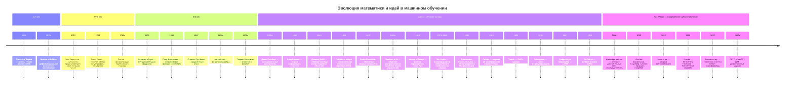

```mermaid
timeline
    title Эволюция математики и идей в машинном обучении

    section XVII век
        1654 : Паскаль и Ферма — основы теории вероятностей
        1670s : Ньютон и Лейбниц — дифференциальное исчисление, производные

    section XVIII век
        1713 : Якоб Бернулли — «Искусство предположений», закон больших чисел
        1763 : Томас Байес — теорема Байеса (опубликована посмертно)
        1780s : Лаплас — формализация байесовского подхода

    section XIX век
        1805 : Лежандр и Гаусс — метод наименьших квадратов
        1840 : Пьер Ферхюльст — логистическая функция (сигмоида)
        1847 : Огюстен Луи Коши — градиентный спуск
        1850s : Артур Кэли — матричная алгебра
        1870s : Людвиг Больцман — энтропия в физике

    section XX век — Ранние основы
        1900s : Давид Гильберт — функциональные пространства
        1948 : Клод Шеннон — теория информации, энтропия
        1949 : Дональд Хебб — «Hebbian learning» (нейро-подобное обучение)
        1951 : Роббинс и Монро — стохастическая аппроксимация (прообраз SGD)
        1957 : Фрэнк Розенблатт — Персептрон (первые нейросети)
        1960s : Брайсон и Хо — обратное распространение ошибки (в теории управления)
        1969 : Мински и Паперт — критика персептронов, «зима ИИ»
        1974–1980 : Пол Уербо — backpropagation в нейросетях (не опубликовано широко)
        1986 : Румельхарт, Хинтон, Уильямс — backpropagation в ML (революция)
        1989 : Сиборг — теорема об универсальной аппроксимации
        1995 : Vapnik — SVM с ядрами
        1996 : Тибширани — Lasso (L1-регуляризация)
        1997 : Хофрайтер и Шмидхубер — LSTM
        1998 : Ян ЛеКун — LeNet-5 (первая CNN)

    section XX–XXI век — Современное глубокое обучение
        2006 : Джеффри Хинтон — глубокие доверительные сети, «пробуждение» DL
        2012 : AlexNet (Крижевский, Суцкевер, Хинтон) — прорыв в ImageNet
        2012 : Hinton и др. — Dropout (регуляризация)
        2015 : Google — TensorFlow; Facebook — Torch/PyTorch (autodiff)
        2017 : Васвани и др. — \"Attention is All You Need\", трансформеры
        2020s : GPT-3, ChatGPT, LLM, диффузионные модели

```